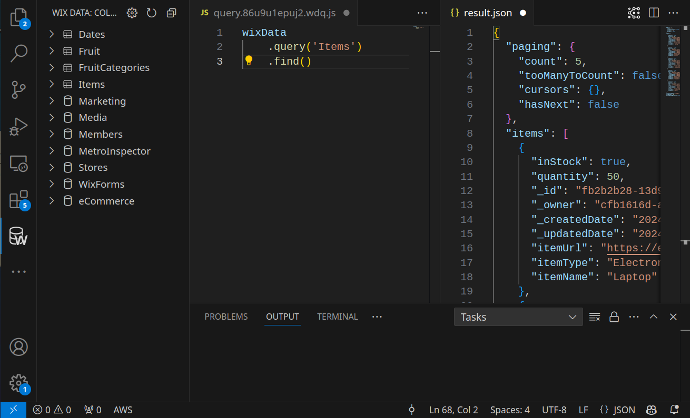
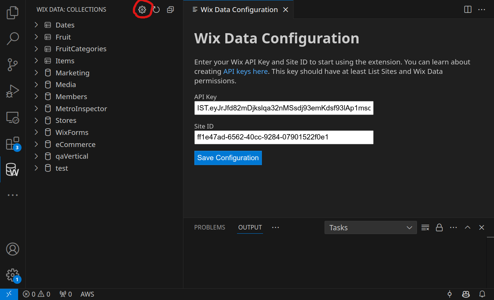
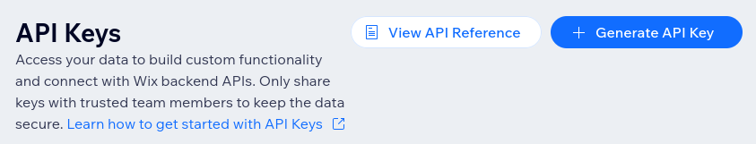

# Wix Data Viewer

This extension allows viewing structure of a Wix site database, as well as run queries against it.



## Configuration

To use the plugin:
1. Open configuration panel
2. Enter your API Key
3. Enter site ID

You can enter configuration screen by clicking on the gear icon above the collection tree.



Go to your Wix Account Settings and choose API Keys in the left panel.



Click Generate API Key and select the following permissions:
* Get Sites List
* Wix Data (from All site permissions section)

Click Generate Key. Use the key in the configuration.

Next go to the dashboard of a site you want to connect to.

The URL should look similar to:
> https://manage.wix.com/dashboard/ff1e47ad-6562-40cc-9284-07901522f0e1/home

You can copy the site ID from the URL. In this example the Site ID is ff1e47ad-6562-40cc-9284-07901522f0e1.

## Usage

The Plugin allows calling arbitrary Wix Data APIs. The following APIs are supported:
* [Wix Data Items](https://dev.wix.com/docs/velo/api-reference/wix-data/introduction)
* [Collections](https://dev.wix.com/docs/sdk/backend-modules/data/collections/introduction)
* [Indexes](https://dev.wix.com/docs/sdk/backend-modules/data/indexes/introduction)

It will run queries like:

```javascript
wixData.query("Items").find()
```

```javascript
collections.listDataCollections()
```

```javascript
indexes.listIndexes('Items')
```

To run the query execute 'Wix Data: Write Query' command, this will open the query editor. Execute by clicking the triangle icon.

