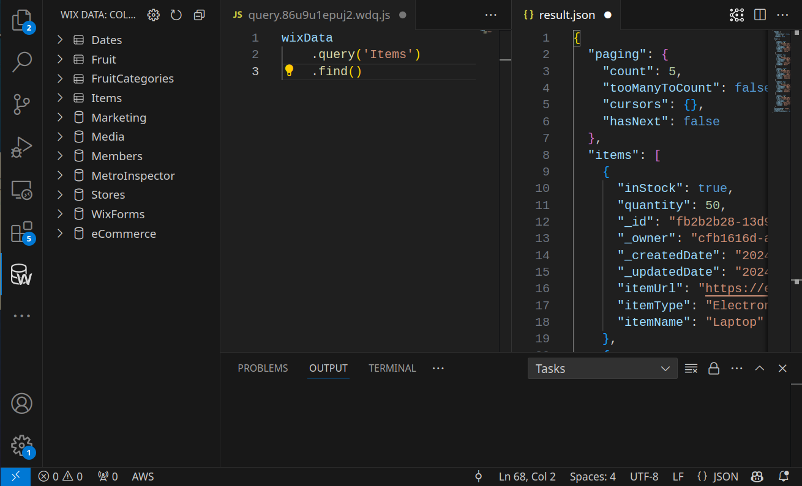
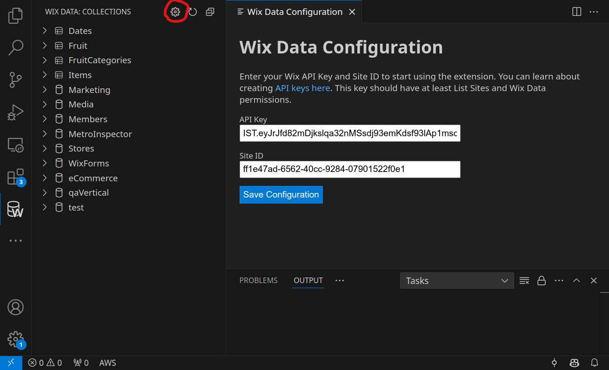
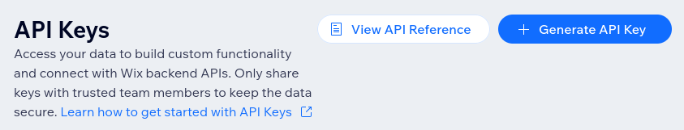

# Wix Data Viewer

This extension lets you view the structure of a Wix site database, as well as run queries against it.



## Configuration

The extension will auto-configure if:
* Wix CLI is installed on the system
* plugin is running in online IDE hosted by Wix

Alternatively, it's possible to manually configure the IDE:
1. Open configuration panel
2. Enter your API Key
3. Enter Site ID

You can open the configuration screen by clicking the gear icon above the collection tree.



Go to your Wix Account Settings and choose API Keys in the left panel.



Click Generate API Key and select the following permissions:
* Get Sites List
* Wix Data (from All site permissions section)

Click Generate Key. Use the key in the configuration.

Next, go to the dashboard of a site you want to connect to.

The URL should look similar to:
> https://manage.wix.com/dashboard/ff1e47ad-6562-40cc-9284-07901522f0e1/home

You can copy the Site ID from the URL. In this example the Site ID is ff1e47ad-6562-40cc-9284-07901522f0e1.

## Usage

The Plugin allows calling some of Wix Data APIs. The following APIs are supported:
* [Wix Data Items](https://dev.wix.com/docs/velo/api-reference/wix-data/introduction)
* [Collections](https://dev.wix.com/docs/sdk/backend-modules/data/collections/introduction)
* [Indexes](https://dev.wix.com/docs/sdk/backend-modules/data/indexes/introduction)
* [Backups](https://dev.wix.com/docs/api-reference/business-solutions/cms/operations/backups/introduction)
* [Data Movement Jobs](https://dev.wix.com/docs/api-reference/business-solutions/cms/operations/data-movement-jobs/introduction)

It will run queries like:

```javascript
wixData.query("Items").find()
```

```javascript
collections.listDataCollections()
```

```javascript
indexes.listIndexes('Items')
```

```javascript
backups.listBackups()
```

```javascript
movementJobs.queryJobs({})
```

To run the query, execute 'Wix Data: Write Query' command. This opens the query editor. Execute the query by clicking the triangle icon.

